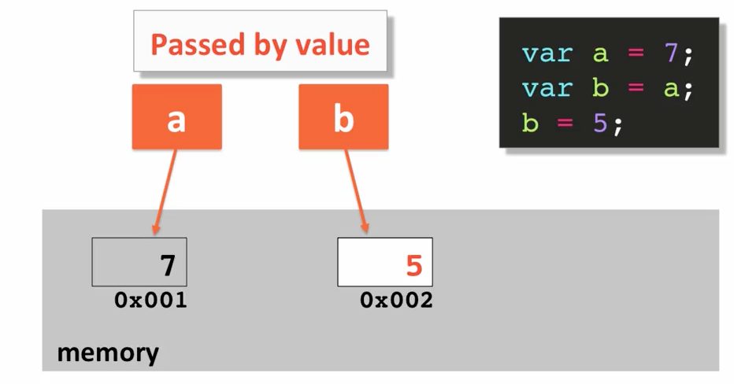

## Passing Variables: By_Value vs. By_Reference  :dragon:
 
### <kbd>I</kbd> Passing By Value  :tanabata_tree:
Given <strong>b=a</strong>, passing/copying by value means changing
copied value in <strong>b</strong> does not affect the value stored
in <strong>a</strong> and visa versa.

So if I change the value of <strong>b</strong>, 
it will not affect the value of <strong>a</strong>

### <kbd>II</kbd> Passing By Reference  :wind_chime:

Given **b=a**, passing/copying by reference means
 changing copied value in **b** does affect the value
 stored in **a** and visa versa.

### In JavaScript:  :wrench:

#### <kbd>1</kbd> <u>Primitives Are Passed By Value</u>

```sh
     var a = 7;
     
     var b = a;
```
     
> **b** ends up with the same value as **a**.


 
 
 When we declared **variable a** and equal it to **7**.             
 In memory, **a** gets memory allocation (**address 001**) and the value 
 sitting in that memory is **7**.  :low_brightness:   
 
     
 Then we declared **var b** and copy the contents of **var a** into **b**.   
 In memory, we're allocating another memory location (**002**) and 
 we're copying the value **7** into that memory location.  :low_brightness:
 
#### <kbd>2</kbd> <u>Objects Are Passed By Reference</u>

```sh
     var a = {x: 7};
     
     var b = a;
```
     
>  **b** ends up with the same value as **a**.

  
 

 When we override the **variable b** with the value **5**,   
 then what we're doing is replacing a different value into the 
 same memory location that **b** is pointing to (**002**).  :bulb:
 
 
 
 So here, what you'll end up with is that **a** is still pointing
 to its original location **001**, which still has number **7** in it as
 the value in that memory location, and **b** is now pointing to **002**
 with a different value.           
 So therefore **a** and **b** have nothing to do
 with each other, and at this point they are not effective on 
 the other.   :high_brightness:
 
 
####  :black_medium_small_square: <u>var a = {x: 7}; we declared an object</u>           
 
 
> This is an object literal with a property x:7.     
 
  

 Again **001** is the memory location, but what gets put into that
 memory location as the value is another memory location (**003**)
 that is pointing to another point in memory. So **003** is where the
 value actually sits.
 
 So then when we declared **variable b** and equate **variable b** to **a**.   
 What's actually happening is that again the value of **variable a**,
 where **variable a** is pointing to, is copied into **variable b**.
 
 The value **003** is copied into **b**. So **b** now which is sitting on **004**
 it's value is another memory location with a value of **003**.
 
 
  
 Now both **var a** and **var b** are pointing to **003**. So when we update
 what we are updating is the memory location which is what
 is changing. And this is called **passed by Reference**.
 
 The **value of a** and **value of b** still the same (**003**)
 
 The **difference** between **passed by value** and **passed by reference**
 is that
 
 
:curly_loop: **in passed by value**:           
- the values once it's changed do not affect the original value of the original variable.

:curly_loop: **when passed by reference**:       
- when you change the value, the original object that's pointing to it is changed as well.


<br />
<hr>
### If that wasn't enough   :interrobang:


### Passing by Value

// sets var a and takes a space on memory     
**var a = 7;**

// a is primitive so should copy by value, and take a
   separate space in memory   
**var b = a;**

> "b" is no longer pointing anywhere "a" is pointing to

console.log("var a: " + a);    
console.log("var b: " + b);   
  
:black_small_square: then we update **b = 5;**

- **a** remains **7**
- **b** is now **5**

### Passing by Reference

// object literal not a primitive value anymore    
**var a = { x: 7 };**

// now we're copying the memory location that is pointing
   to 7 and not the actual value.
   
**var b = a;**

console.log(a);  &nbsp; &nbsp; //Object {x:7}  
console.log(b);  &nbsp; &nbsp; //Object {x:7}

:black_small_square: then we update **b.x = 5;**

console.log(a); &nbsp; &nbsp; //Object {x:5}    
console.log(a); &nbsp; &nbsp; //Object {x:5} 


<kbd>summary</kbd>

 
 :collision:
 
````
      
      var x = 5;
      var y = x;
      x = 10;
      console.log(y);
      
      returns 5   // why u ask? :) cause x is first set to 5 in memory.       
                  // Then y is set to the value of 5 in another      
                  // allocated space in memory.     
                  // then you set x to 10.    
                  // whatever you do to x at this point, has nothing to do with y anymore.    
                  // y remains 5.    
                  
````

 
