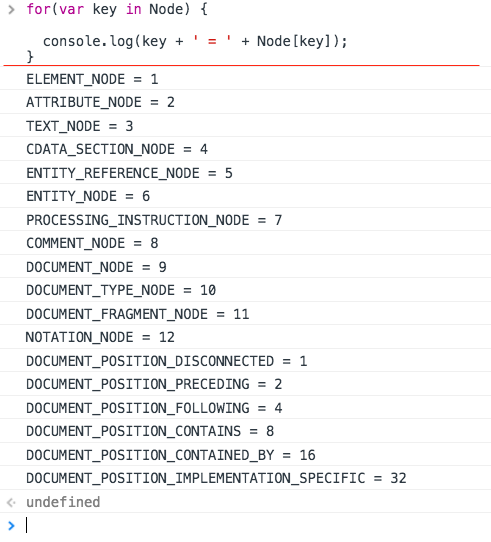
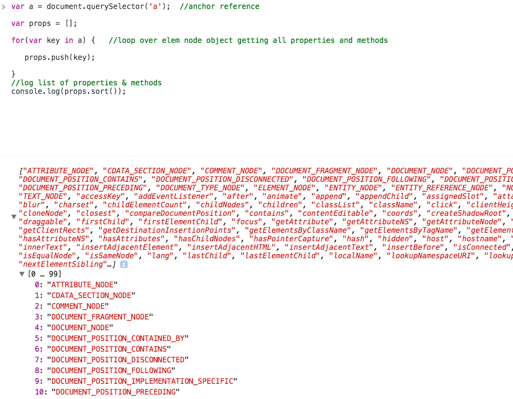

### log of all the node types and their values
- `Node` is just a javascript constructor function.    
- `Node` inherits from `Object.prototype`

<br />
  
 <kbd>node types</kbd>       
 
 
 
 <br />
  
 <kbd>node types</kbd>       
 


<br>

### list of properties available to the element node object

<hr>


|         Node Property                                                           |
|   :-----------------------                                                     |      
|                                                                                | 
|    ChildNodes                                    |
|    firstChild                                         |
|    lastChild                           |
|    nextSibling                           |
|    nodeName                    |     
|    nodeType                       |
|    nodeValue                                                    |
|    parentNode      |   
|    previousSibling                       |
      
                                       
<br/>


|         Node Methods                                                           |
|   :-----------------------                                                     |      
|                                                                                | 
|    appendChild()                                    |
|    cloneNode()                                        |
|    compareDocumentPosition()                           |
|    contains()                           |
|    hasChildNodes()                    |     
|    insertBefore()                       |
|    isEqualNode()                                                    |
|    removeChild()      |   
|    replaceChild()                       |


### determining the type of node so that you might know which properties and methods are available
- ex
  - console.log(document.querySelector('a').nodeType === Node.ElEMENT_NODE);
  => //true
  
  
<br><br>
  
### insertBefore
- requires 2 parameters:
  - node to be inserted    
  - reference node in document    

var div = document.createElement('div');         
div.id = 'ste';     
div.textContent = 'hello';      

//handle      
var handle = document.querySelector('handle');      
//append       
handle.insertBefore(div,handle.firstChild);        


<br><br>

### cloneNode()
- it is possible to duplicate a single node or a node and all of its children

example:      

```
    <ul>
      <li>Hi</li>
      <li>there</li>
    </ul>
    
    var cloneUL = document.querySelector('ul').cloneNode();
    console.log(cloneUL);
    
    => Hi
    => there
```


  
