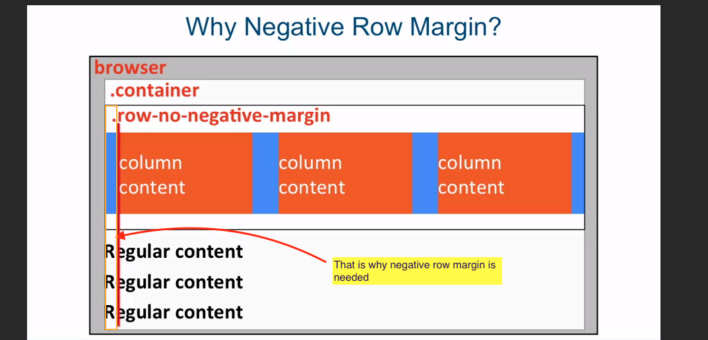
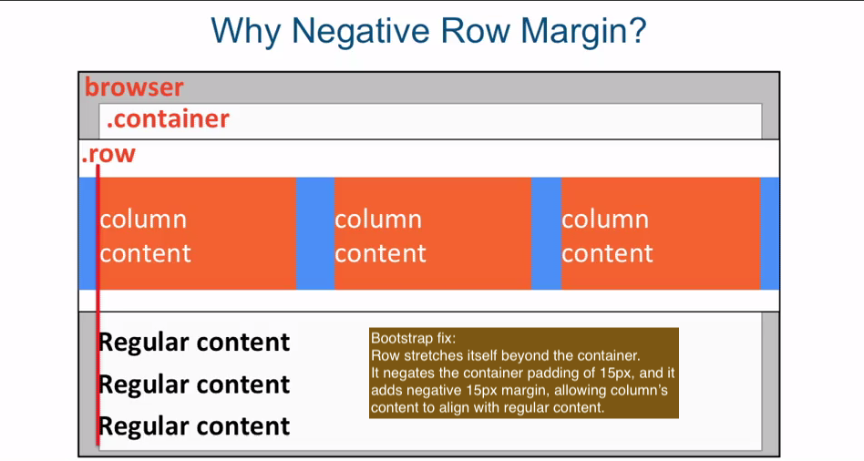
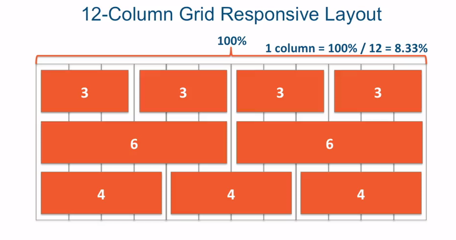
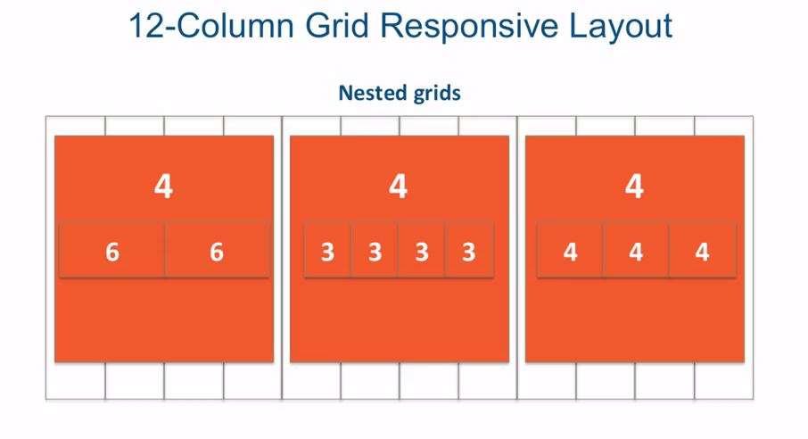

# twitter bootstrap
- html, css and js framework for developing responsive, mobile first projects on the 
  web.
- made mostly of css of classes
- Mobile first == plan mobile from the start
  * css framework either yours or bootstrap, should be mobile ready

### bootstrap grid systems basics. &nbsp; :hamburger:

```
  <div class="container">
    <div class="row">
      <div class="col-md-4">Col 1</div>
        ...
    </div>
  </div>
```
or 

```
  <header class="container">
    <nav class="row">
      <div class="col-md-4">Col 1</div>
        ...
    </nav>
  </header>
```

<hr/>

### about the grid &nbsp; :rice:

- bootstrap grid must always be inside of a container wrapper. &nbsp; :zap:
- container class options:
  + container (pre-determined fixed widths at different breakpoints) &nbsp; :zap:
  + container-fluid. (100% width of the browser and provides consistent padding) &nbsp; :zap:

- row class creates horizontal groups of columns
  + columns collapse and interact with each other as a group, but independently
    for columns in another row
  + row also creates a negative margin to counteract the padding that the container
    class setup  


<kbd>negative row margin</kbd>  &nbsp; :stew:


<hr/>

<kbd>bootstrap fix</kbd>
<br/>



### bootstrap columns

- every single column in bootstrap is defined using this template:

```
   col-SIZE-SPAN
```

#### size:  &nbsp; :zap:
- screen width range identifier
- xs,sm,md,lg

ex:

```
 if set lg 1200px,other columns below that width will collapse

```

#### span. &nbsp; :zap:
- how many columns element should span
- values: 1 through 12


<br/><br/><hr/>


# @media Queries & Responsive Layout

ex:

```
/* Media Query Syntax */

@media (max-width:767px) {
   p {
    color:blue;
  }
}

```

### each media feature (resolves to true or false). &nbsp; :icecream:

```
  @media (max-width:800px) {...}

  @media (min-width:800px) {...}

  @media (orientation: portrait) {...}

  @media screen {...}

  @media print {...}

```

### devices with width within a range. &nbsp; :ram:

```
 @media (min-width:768px) and (max-width:991px) {...}

```

## comma between media queries becomes an ***OR***. &nbsp; :dog2:

```
 /* any device who's width is no larger than 767px or devices who's width no smaller than
    992px
 */
 @media (max-width: 767px), (min-width:992px) {...}

```

## Media Query Common Approach. &nbsp; :cat2:

- base styles

```
/************* base styles *********/
 p1 {color: blue;}
 .container {
   display:block;
   background:gray;
   width:300px;
   height:300px;
 }

 p2 {color: blue;}
 .container {
   display:block;
   background:gray;
   width:50px;
   height:50px;
 }

```

- and media queries &nbsp; :goat:

```
/******************* large devices only ****************/
@media (min-width:1200px) {
 
 ...
}

/************* medium devices only **********************/

@media (min-width:992px) and (max-width:1199px) {
 
 ...
}

```

## 12-column Grid Responsive Layout &nbsp; :pig:

<kbd>responsive layout grid</kbd>

1 column => 100%/12 = 8.33% * (number of columns)



<br/>

<kbd>nested grids</kbd>

```
       4      4      4

      6 6   4 4 4   6 6
```




