### Long-term <kbd>OBJECTIVE:</kbd>   <KBD>JAVASCRIPT</KBD> <KBD>PERIODIC</KBD>  <KBD>TABLE</KBD>
:package: To build a comprehensive sample-based JavaScript cheat sheet... 

:bookmark: for every method, 
:bookmark: property, 
:bookmark: primitive type, 
:bookmark: object, or 
:bookmark: built-in function included

  
 
  
 <KBD>nanoProgressBar</KBD>
 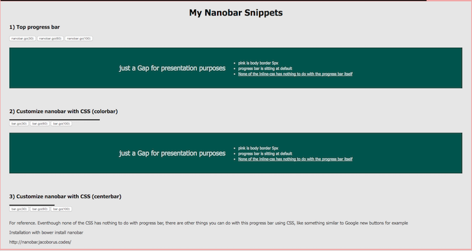

  
 
 
 
 <KBD>progressBar</KBD>
 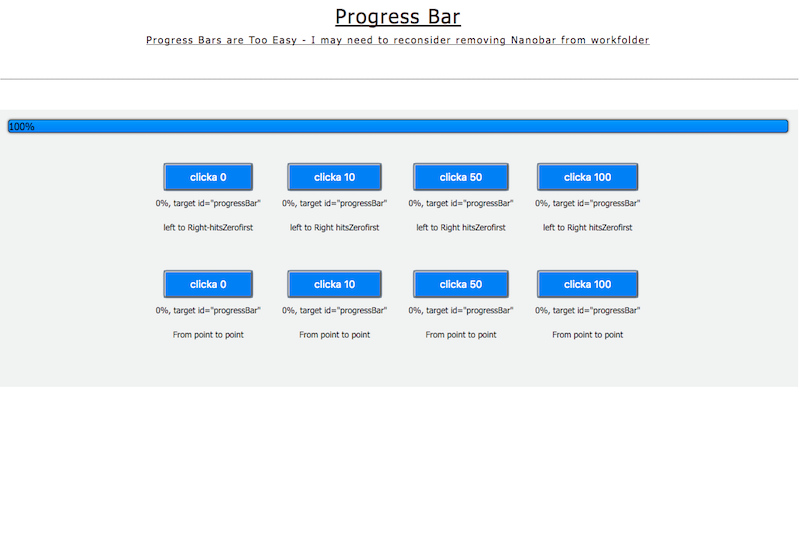
 

 

  
 

 
  
 
  
 <kbd>thePropagationShow1</kbd> :mag:
 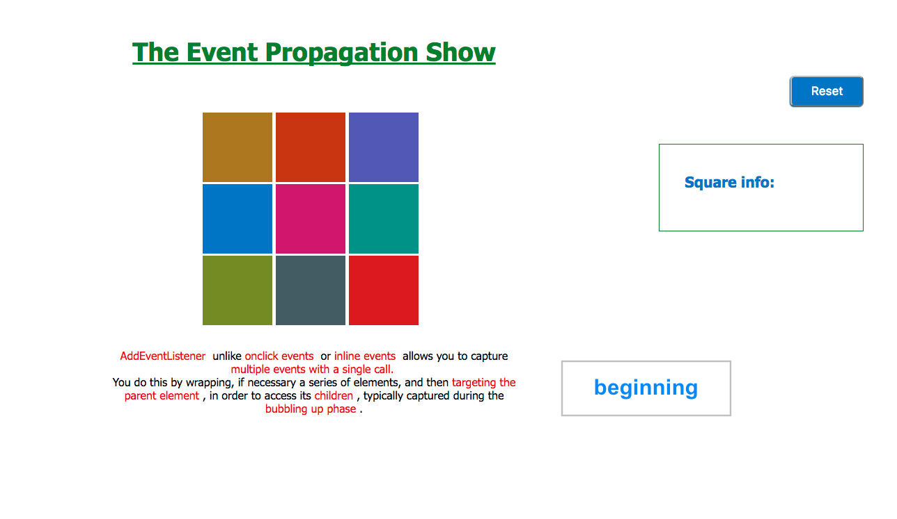

<kbd>thePropagationShow2</kbd> :mag:
 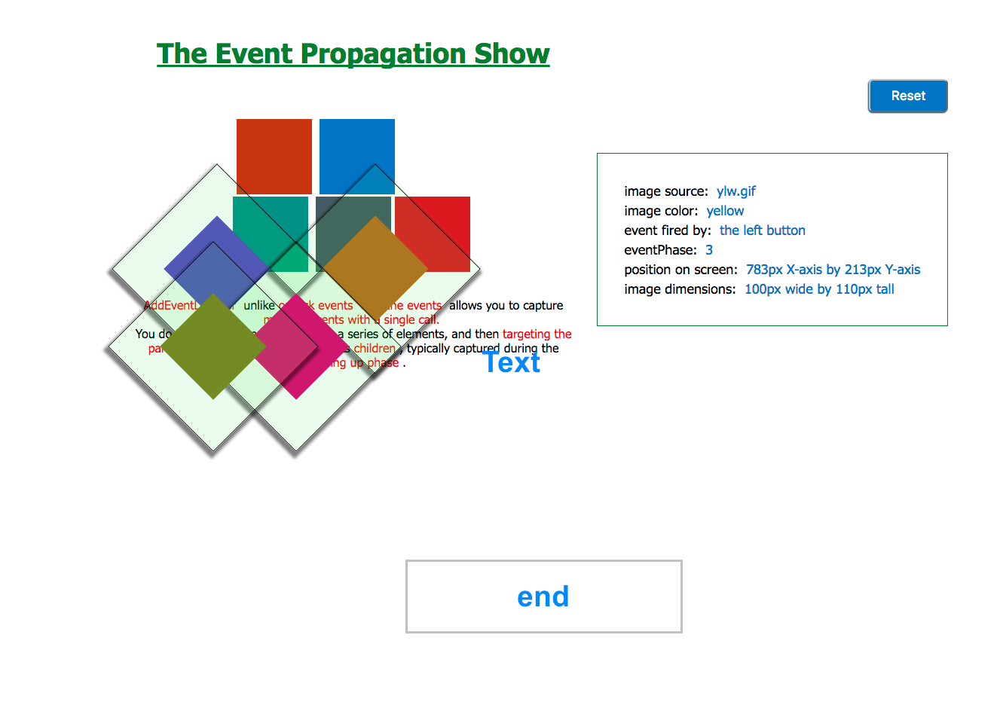

 

 <KBD>OddEven</KBD> 
 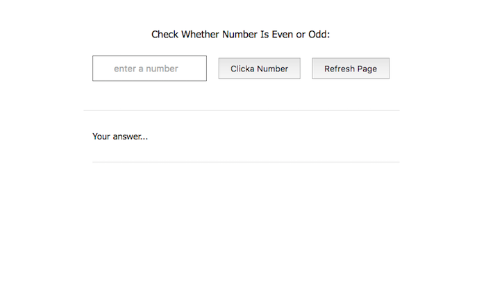
 
 
 
 
 
  
 
  
  
  
 <KBD>switch_case,_if_statement,_date_object</KBD>
 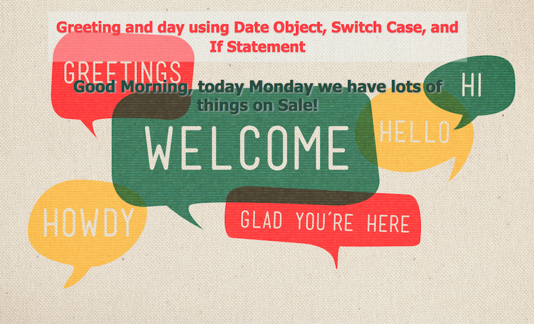
 
 
 
  
 

  
 <KBD>arrays:push,_shift,_unshift,_pop,_splice</KBD> 
 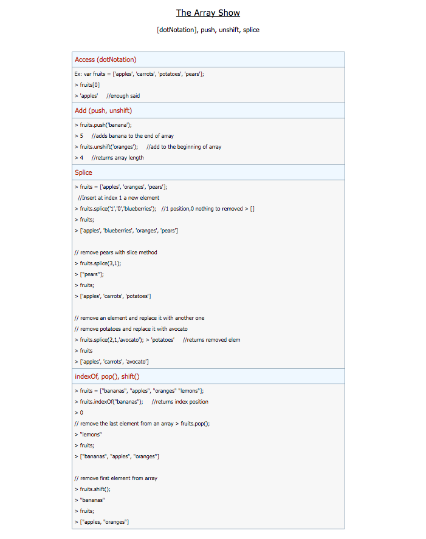
 
 
 

 
  
 
  
 <kbd>clock</kbd> 
 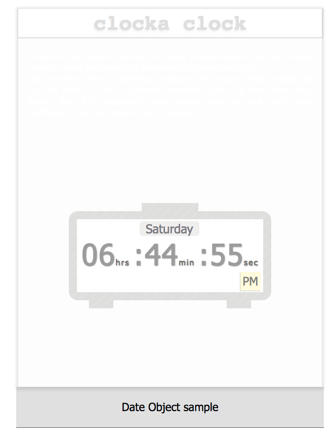
 
 
 
  
 
  
 <kbd>popup window</kbd> 
 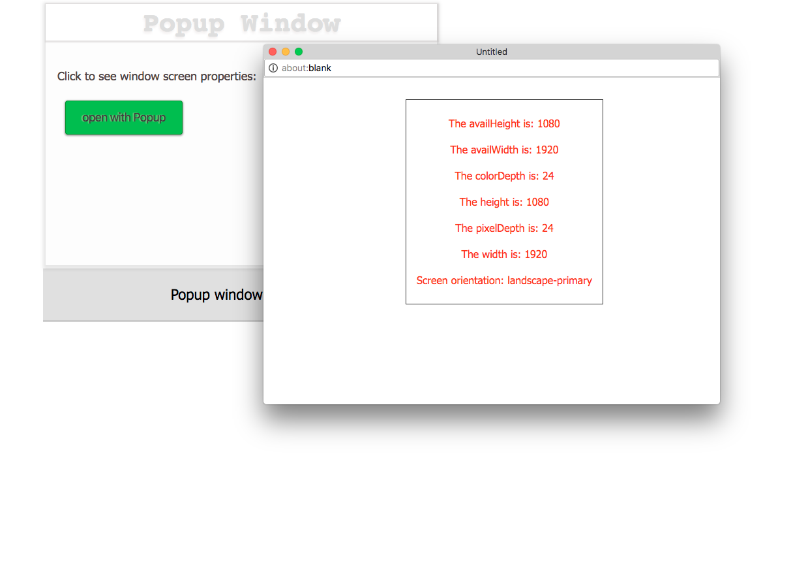
 
 
 
  
 
  
 <kbd>bubbling phase - mouseover event</kbd> 
 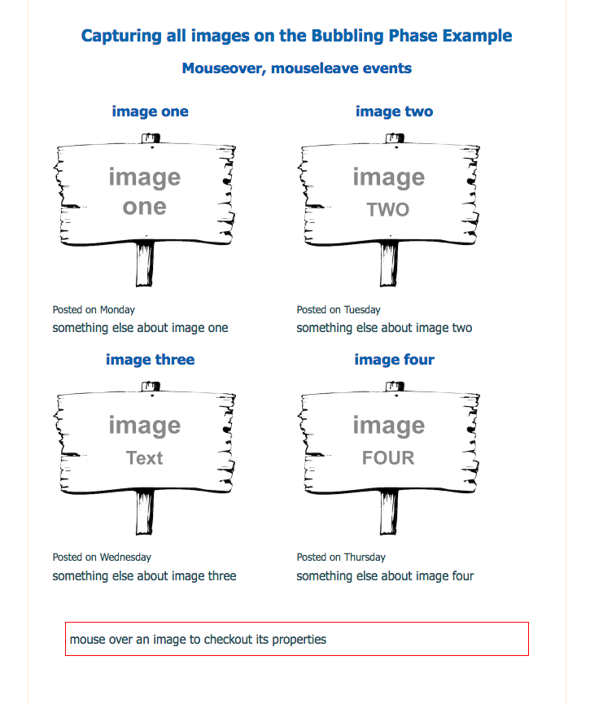
 
 
 
  
 
  
 <kbd>bubbling phase - mouseover event</kbd> 
 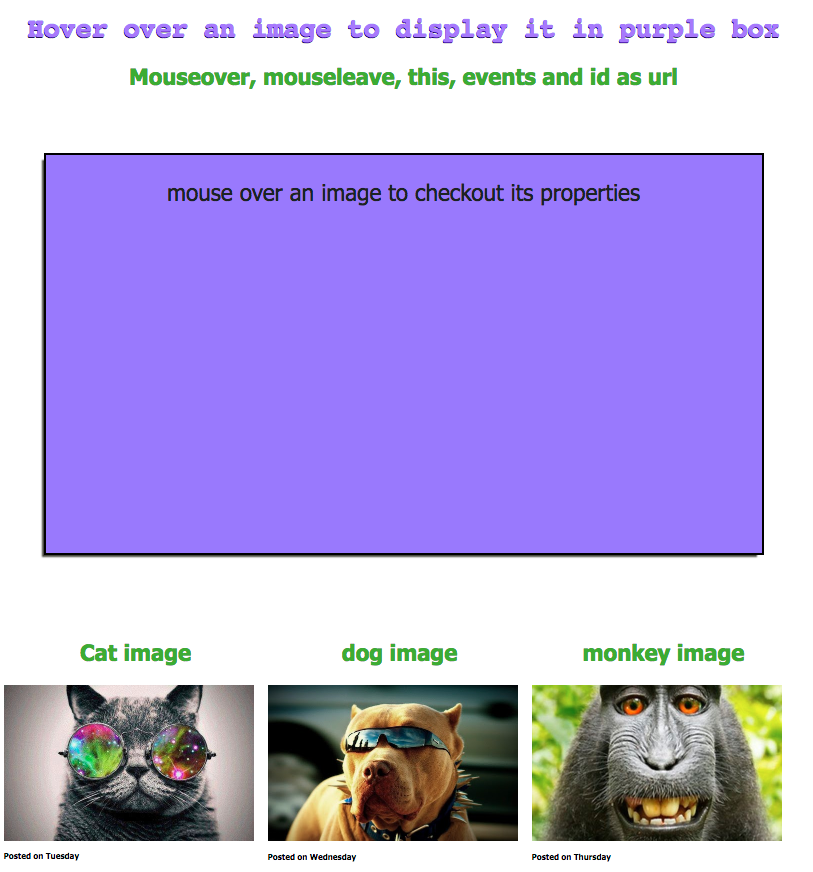
 
 
 
  
  
 
  
 <kbd>jsonAjax</kbd> 
 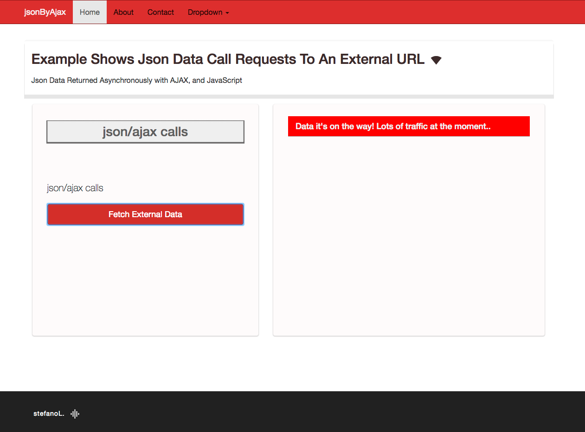
 
 
 
  
 
  
 <kbd>ajax2</kbd> :mag:
 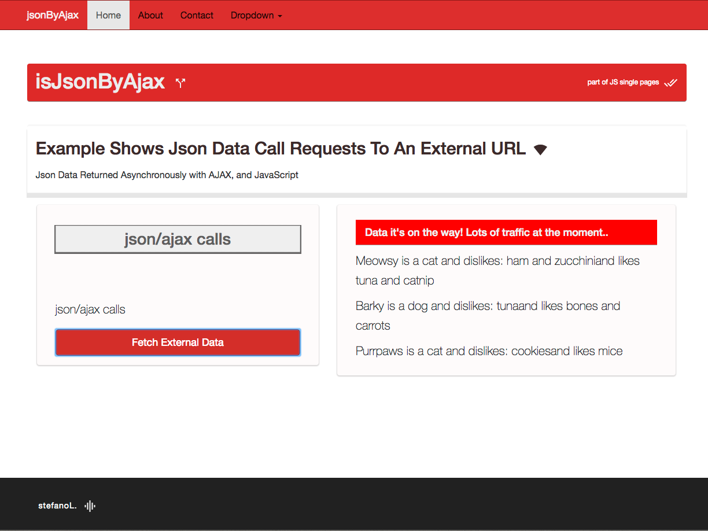
 
 
 
 
  
 
  
 <kbd>canvasAPI</kbd> :mag:
 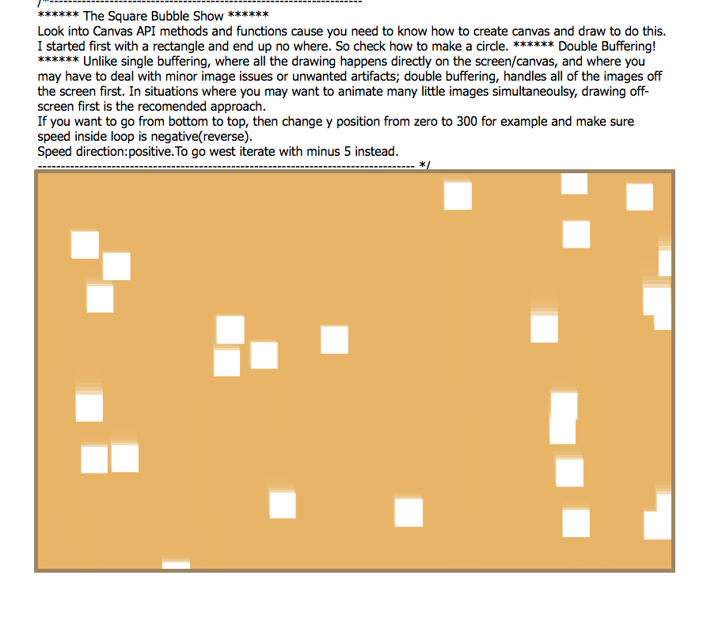
 
 
 
 
  
 
  
 <kbd>moonCut canvas</kbd> :mag:
 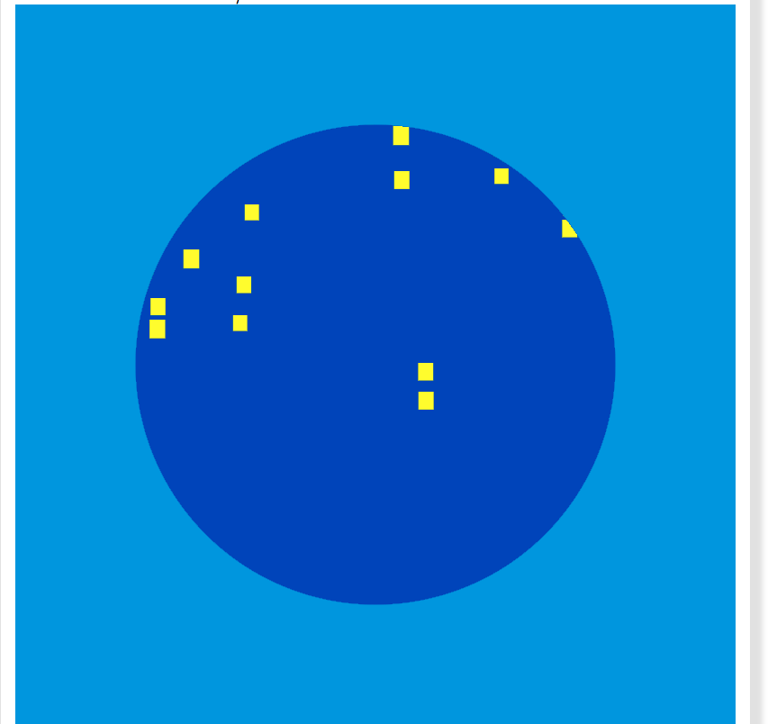
 
 
 
 
  
 
  
 <kbd>toggle jquery</kbd> :mag:
 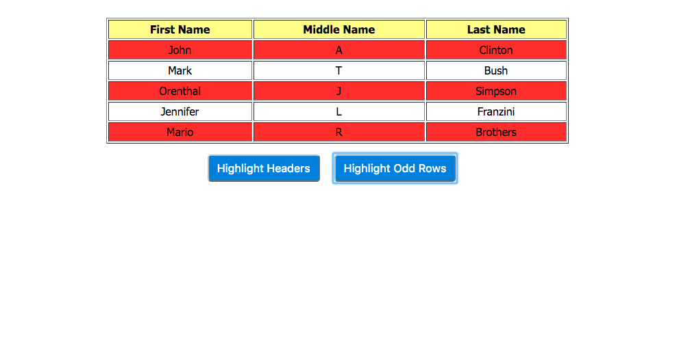
 
 
  
  
 
  
 <kbd>orange clock</kbd> :mag:
 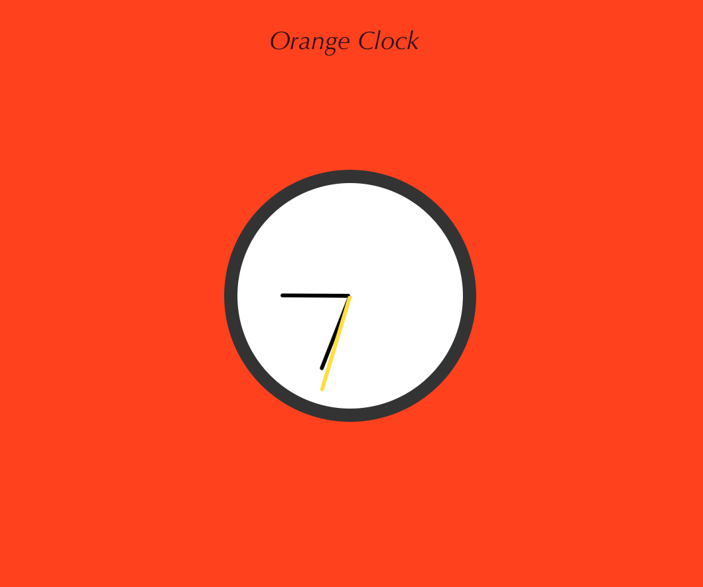
 
 
