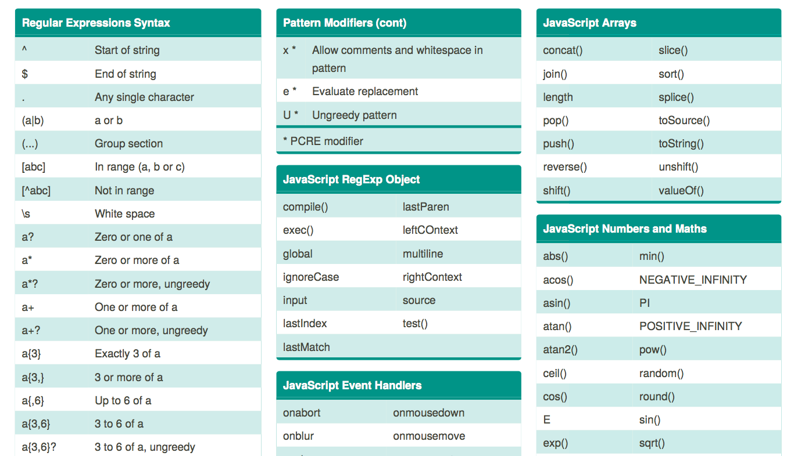
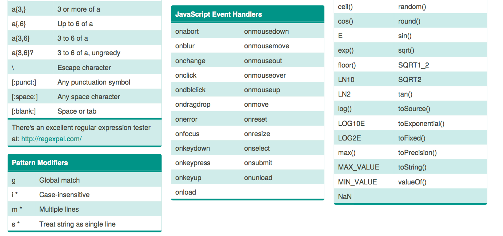
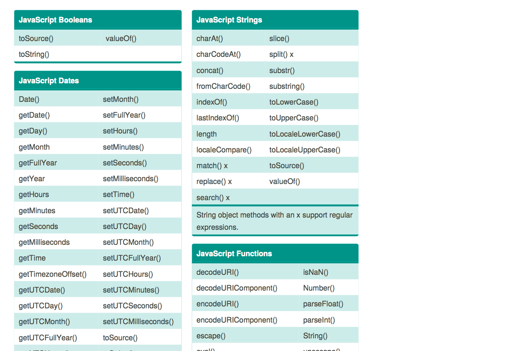
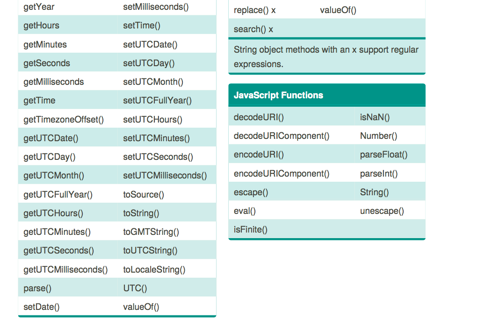

## :construction:&nbsp; old <kbd>REPO</kbd>, new <kbd>REPO</kbd> Merged&nbsp;&nbsp;  :construction:

## :one: <kbd>JS</kbd> notes and    (:rocket: best javascript notes! <kbd>JS</kbd>)     
## :two: new <kbd>JS</kbd> snippets <kbd>LIB</kbd> in progress

> (new notes part of a 5 modules JavaScript course taken online from the University of Chicago, Illinois.)

 
  
 <kbd>js</kbd> :mag:
 
 
  
 
  
 
  
 <kbd>js</kbd> :mag:
 

 
  
 
  
 <kbd>js</kbd> :mag:
 

 
  
 
  
 <kbd>js</kbd> :mag:
 
 
 
 
 
 
  

