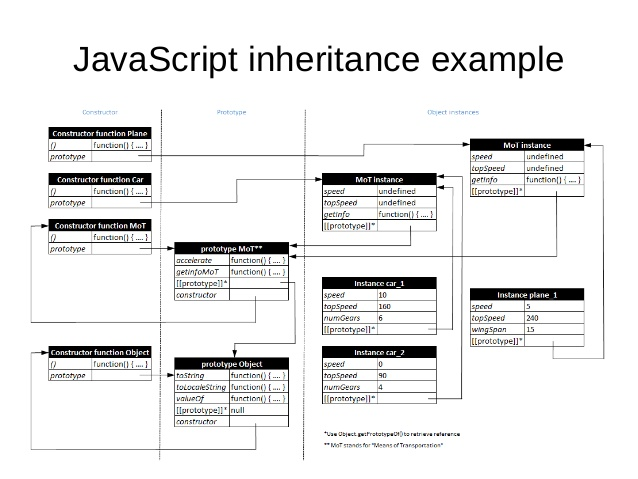

## :one: <kbd>BEST JS NOTES!</kbd> all taken by me.   &nbsp;:coffee:  
> (new notes part of a 5 modules JavaScript course taken online from the University of Chicago, Illinois.)

## :two: <kbd>JS</kbd> snippets <kbd>LIB</kbd> ongoing.. &nbsp;:rocket:

  
 <kbd>js</kbd> :mag:
  
 

<kbd>js-inheritance</kbd> :mag:
 
  
 
 
 
 
 
 
 
  

