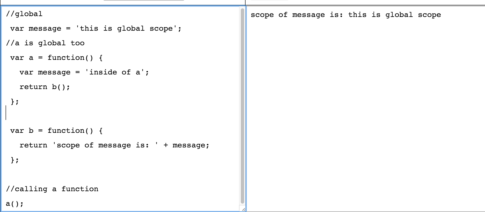

# Scope

[](https://github.com/stefan22/eloqJS/blob/master/eloqJSnotes/5.%20Global_n_Local_Scope.md)

Global and Local Scope (or function scope). To understand Global is to know the difference, so
lets try to explain it.

  - Global is where it is first originated (the variable)
  - Global/local Scope is always going to be related to the execution of some code/function
  - Generally if var has been set inside of a function, then likely to be local to the function
  
But to understand Scope, you need to understand that EveryTime a Function/Code block gets Executed,
it automatically creates its own (a brand new) execution context for that particular function/code, 
also it creates a $this object and an OUTER context Env; which makes it possible to further reach out, 
onto a more Outer Var - a more Global one, if it needs to.

### Example js file  - Question is what is the value of message when you call function a
I just explained it here above. But basically, exec a, it also invokes b; which then needs to pick
between content from var message inside of a, or var message sitting outside of a content.


```sh
//var message is on a global scope
var message = 'this is global scope';
//a is global too and message is local to a
var a = function() {
    var message = 'inside of a';
    return b();
}
//b is on a local scope
var b = function() {
 return 'scope of message is: ' + message;
}

//calling a function
a();

```
#### Starts by Calling/exec Function A

    - exec a calls function b
    - b only passes message in a
    - message did not first originated inside of function a
    - there was a var message before that.
    - exec of function creates a new context env that allows function b
      to go higher/outside of a if needs to 
    - finds var message and assigns the val of that var to message.


